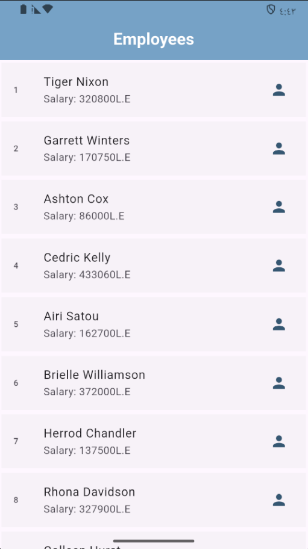
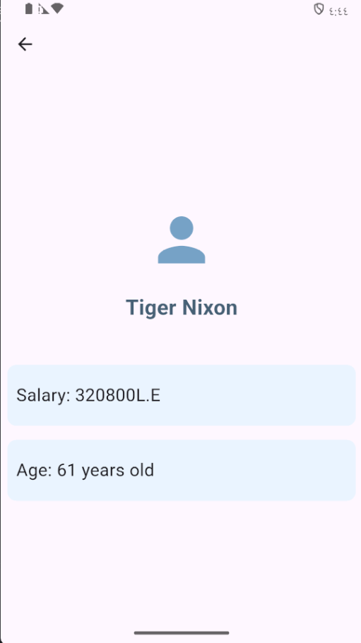
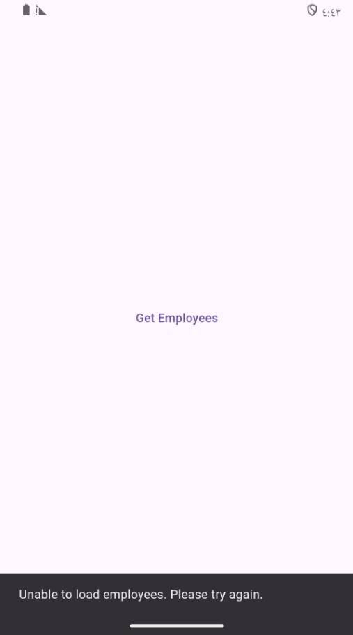
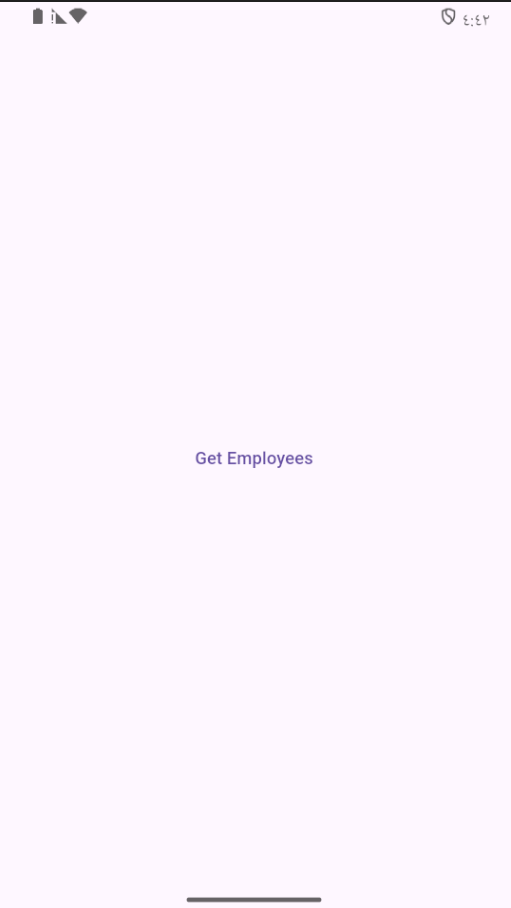

# Employee Directory

A Flutter application for browsing employee records from the
[Dummy REST API](https://dummy.restapiexample.com/api/v1/employees). The app
loads employee data, stores a local copy for offline use, and presents each
employee in a list with a dedicated details screen.



## Features

- Fetches employee records from a REST API using Dio.
- Parses API JSON responses into strongly structured employee models.
- Caches the latest successful response with `shared_preferences`.
- Reads cached data when it is available, supporting offline access.
- Displays employee names in a list.
- Opens a detail view with employee name, salary, and age.
- Shows a simple, user-friendly `SnackBar` when loading or parsing fails.





## How It Works

1. `main.dart` starts the Flutter application and opens `MainScreen`.
2. The user selects **Get Employees**.
3. `EmployeeServiceDio.getEmployeesData()` checks local storage for a cached
   response.
4. If cached data exists, it is decoded and converted into `EmployeeModel`
   objects. Otherwise, the service requests fresh data from the API and saves
   the response locally.
5. `EmployeesScreen` renders the models in a scrollable list.
6. Selecting an employee opens `EmployeeDetailsScreen`.
7. If the API request, cache read, JSON decoding, or model conversion fails,
   the service propagates the error and `MainScreen` shows a friendly message:
   `Unable to load employees. Please try again.`

## Project Structure

```text
lib/
├── main.dart                         # Application entry point
├── models/
│   └── employee_model.dart            # Employee data model
├── screens/
│   ├── main_screen.dart               # Load action and error SnackBar
│   ├── employees_screen.dart          # Employee list
│   └── employee_details_screen.dart   # Employee details
├── services/
│   ├── employee_service.dart          # HTTP service using package:http
│   └── employee_service_dio.dart      # Active Dio service with caching
└── widgets/
		├── employee_list_tile.dart        # Employee list item
		└── employee_Info.dart              # Employee information row
```

## Requirements

- Flutter SDK compatible with Dart `3.13.0` or later within the declared SDK
  constraint.
- An available Flutter device, emulator, simulator, or desktop target.
- Internet access on the first run when no cached response exists.

Check the local installation with:

```bash
flutter --version
flutter doctor
```

## Create the Project From Scratch

These commands create an equivalent Flutter application structure. Run them
from the directory where the project should be created:

```bash
flutter create employee_directory
cd employee_directory
flutter pub add dio
flutter pub add http
flutter pub add shared_preferences
```

## Install and Run

From the project root:

```bash
flutter pub get
flutter run
```

## API and Caching Notes

- API endpoint: `https://dummy.restapiexample.com/api/v1/employees`
- Cache key: `employeesData`
- Cache storage: `SharedPreferences`
- The current implementation is cache-first. Once data has been cached, the
  app reads that response instead of requesting fresh data until the cache is
  cleared.
- To test the first-run API path again, clear the application data or
  uninstall and reinstall the app.

## Screenshots



